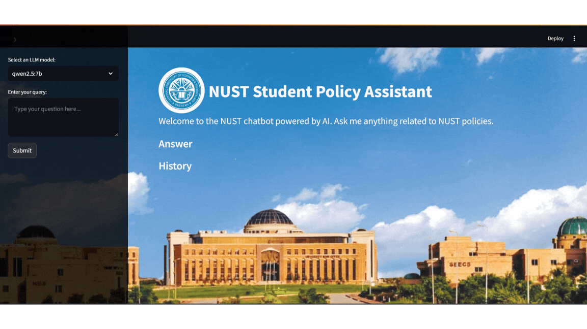

# 📚 NUST Student Policy Assistant

## 🧐 Overview

The **NUST Student Policy** Assistant is a custom knowledge-based chatbot. It utilizes advanced language models and embedding techniques to answer student queries related to the policies of the National University of Sciences and Technology (NUST). The chatbot retrieves precise and context-aware responses from the NUST Student Handbooks using both sentence and TF-IDF embeddings. The project uses **LangChain** and **Retrieval-Augmented Generation (RAG)** techniques to enhance response accuracy. While the current knowledge base includes NUST Student Handbooks, the chatbot can be adapted to work with any other document collection.

---

## 🎨 GUI Preview


---

## 📽️ Demo Video
[](https://www.youtube.com/watch?v=-zkxLiT7z-A)

---

## 🌟 Features

- 📖 **Custom Knowledge Base:** Built from NUST Student Handbooks (Undergraduate, Postgraduate, MBBS).
- 🧠 **Multimodal Embeddings:** Utilizes Sentence Transformers (`all-MiniLM-L6-v2`) and TF-IDF Vectorizer.
- 📈 **FAISS Indexing:** Efficient similarity search with FAISS.
- 🛠️ **Multiple LLM Support:** Choose from LLaMA 3, LLaMA 3.1, LLaMA 3.2, QWEN 2.5, and Mistral.
- 🖥️ **User-Friendly GUI:** Interactive Streamlit interface with model selection and query history.
- 🔒 **Local Deployment:** No internet required for querying as embeddings and models are stored locally.

---

## 🛠️ Setup Instructions

### 📦 Prerequisites

Ensure Python 3.6+ and the following libraries are installed:

- [Ollama](https://ollama.ai/) needs to be installed.
- Large Language Models (LLMs) must be downloaded using the `ollama` command.

### 📦 Setup Guide

1. **Create a Virtual Environment:**
   ```bash
   python -m venv venv
   source venv/bin/activate  # For Windows use `venv\Scripts\activate`
   ```

2. **Install Dependencies:**
   ```bash
   pip install -r requirements.txt
   ```

3. **Ensure Ollama is properly set up:**
   - Download Ollama from the official site.
   - Download a compatible LLM (e.g., `llama3, qwen2.5`) using the Ollama CLI:
     ```bash
     ollama pull llama3
     ollama run llama3
     ```

4. **Run Preprocessing Code:**
   ```bash
   python preprocessing.py
   ```

5. **Run the Chatbot Application:**
   ```bash
   streamlit run main_app.py
   ```

---

## 🏗️ Project Architecture

1. **🧼 Preprocessing:**

   - 🗃️ Extracts text and tables from PDFs using `pdfplumber`.
   - ✨ Cleans data (removing extra spaces, tagging headings, and bullets).
   - 📦 Splits text into smaller chunks for better semantic understanding.

2. **🔢 Embedding Generation:**

   - 🧩 Sentence embeddings generated using `SentenceTransformer`.
   - 📊 TF-IDF embeddings generated using `TfidfVectorizer` for tabular data.

3. **💾 Embedding Storage:**

   - 🗄️ FAISS index for fast similarity search.
   - 📥 TF-IDF stored with `pickle`.

4. **🔎 Query Handling:**

   - 🎯 User input query converted to embeddings.
   - 📚 FAISS and TF-IDF used to retrieve top matching chunks.

5. **💡 Response Generation:**

   - 🤖 Retrieved context fed into an LLM for generating precise responses.

6. **🎨 Graphical User Interface:**

   - 🖥️ Built using `Streamlit`.
   - 🎭 Custom styling and background.

---

## 📊 Results

- **🎯 Accuracy:** LLAMA 3.2 achieved the highest accuracy of **92%**.
- **⏱️ Response Time:** Average response time of **8-10 seconds**.
- **🧪 Testing:** Conducted using a dataset of 37 queries from NUST Handbooks.

---

## 🚀 Future Improvements

- 📑 Support for additional document formats.
- 📦 Expand knowledge base size.
- 🔗 Integration of more advanced LLM models.
- 📡 Real-time updates to the knowledge base.

---

## 🤝 Contributing

Contributions are welcome! Feel free to fork the repository and submit pull requests.

---

## 📜 License

This project is licensed under the MIT License.

---

## 📞 Contact

- **👨‍💻 Authors:** Muhammad Ali, Waqas Jahangir, Shayan Amjad
- **🏫 University:** NUST

---

*Developed as part of the NUST Machine Learning Course Project.*

